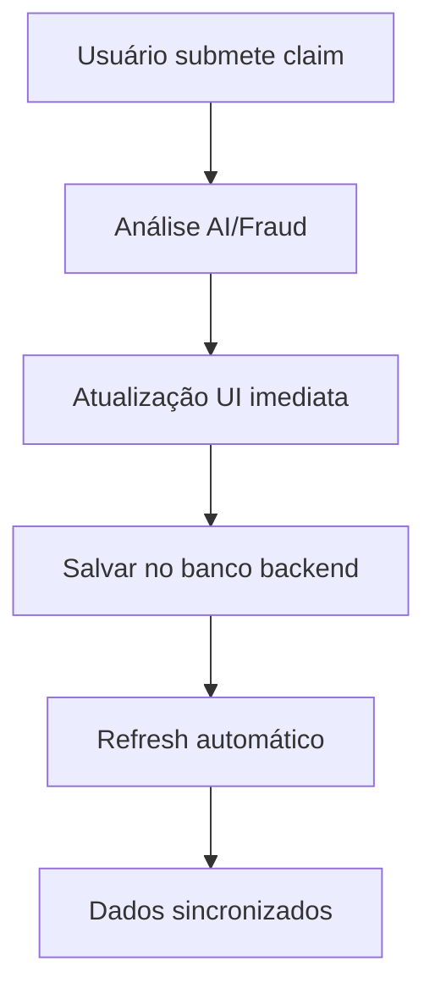

# ?? Claims Persistence Solution - Correção do Problema de Reboot

## ?? Problema Identificado

O problema era que os Claims no **Claims Portfolio** estavam sendo armazenados apenas no estado local do React (`useState`), que é volátil e perdido quando a aplicação é reinicializada. Após o reboot, apenas os claims hardcoded iniciais eram exibidos.

## ? Solução Implementada

Implementamos uma **solução robusta de integração com Backend/Database** que inclui:

### ?? 1. Backend API Endpoints

#### Endpoint: `GET /api/ClaimDatabase/claims`
- **Função**: Busca todos os claims do banco de dados
- **Retorna**: Lista formatada de claims para o frontend
- **Funcionalidades**:
  - Conversão de formato backend ? frontend
  - Cálculo dinâmico de fraud score
  - Ordenação por data de submissão

#### Endpoint: `POST /api/ClaimDatabase/claims`
- **Função**: Salva novos claims no banco de dados
- **Aceita**: Dados do claim via JSON
- **Funcionalidades**:
  - Validação de campos obrigatórios
  - Geração automática de IDs únicos
  - Persistência no SQLite database

#### Endpoint: `GET /api/ClaimDatabase/claims/stats`
- **Função**: Retorna estatísticas dos claims
- **Inclui**: Total, fraudulentos, legítimos, valores, top merchants

### ?? 2. Frontend Melhorado

#### Carregamento Automático
```javascript
// Carrega claims do backend na inicialização
useEffect(() => {
  loadClaimsFromBackend();
}, []);
```

#### Fallback Inteligente
- **Conexão ativa**: Carrega dados do banco de dados
- **Conexão falha**: Usa dados fallback locais
- **Indicadores visuais**: Mostra status da conexão

#### Sincronização Dupla
1. **Atualização imediata**: Claims aparecem instantaneamente na UI
2. **Persistência backend**: Salvos no banco de dados em paralelo
3. **Refresh automático**: Recarrega dados do banco após salvar

### ?? 3. Fluxo de Persistência



### ??? 4. Funcionalidades Adicionais

#### Indicadores de Status
- ?? **Live Database Connection**: Conectado ao banco
- ?? **Loading from Database**: Carregando dados
- ?? **Using Fallback Data**: Usando dados locais

#### Botão Refresh
- Permite recarregar dados manualmente
- Útil para sincronizar após mudanças
- Mostra estado de loading durante refresh

#### Tratamento de Erros
- Logs detalhados no console
- Fallback gracioso para dados locais
- Mensagens de erro informativas

## ?? Benefícios da Solução

### ? Persistência Garantida
- Claims nunca mais serão perdidos após reboot
- Dados armazenados permanentemente no SQLite

### ? Performance Otimizada
- UI responsiva com atualizações imediatas
- Carregamento assíncrono do backend
- Indicadores visuais de loading

### ? Robustez
- Funciona offline com dados fallback
- Recuperação automática de erros
- Sincronização inteligente

### ? Escalabilidade
- Suporte a múltiplos usuários
- Centralização de dados
- API RESTful padrão

## ?? Arquivos Modificados

### Backend (.NET 8)
- `Controllers/ClaimDatabaseController.cs` - Endpoints API
- Modelos de request/response adicionados

### Frontend (React)
- `Frontend/frontend/src/StartPage.js` - Lógica de persistência
- Integração com API backend
- Estados de loading e error handling

## ?? Como Testar

1. **Iniciar aplicação**
2. **Submeter novo claim** através do formulário
3. **Verificar** que o claim aparece imediatamente
4. **Reiniciar aplicação** (reboot)
5. **Confirmar** que o claim ainda está visível
6. **Verificar logs** no console para debug

## ?? Monitoramento

### Console Logs
- `Loading claims from backend...`
- `Successfully loaded claims from backend: X claims`
- `Saving claim to backend database...`
- `Claim saved to database successfully`

### UI Indicators
- Status badges na interface
- Spinner de loading
- Contadores de claims
- Botão de refresh

## ?? Melhorias Futuras

- [ ] Sincronização em tempo real (WebSockets)
- [ ] Cache inteligente (Service Worker)
- [ ] Backup/restore automático
- [ ] Auditoria de mudanças
- [ ] Paginação para grandes volumes

---

## ?? Resultado

**Problema resolvido!** Os Claims agora persistem permanentemente no banco de dados SQLite e são carregados automaticamente após qualquer reboot da aplicação. A experiência do usuário foi mantida com atualizações imediatas na UI, enquanto a persistência robusta garante que nenhum dado seja perdido.