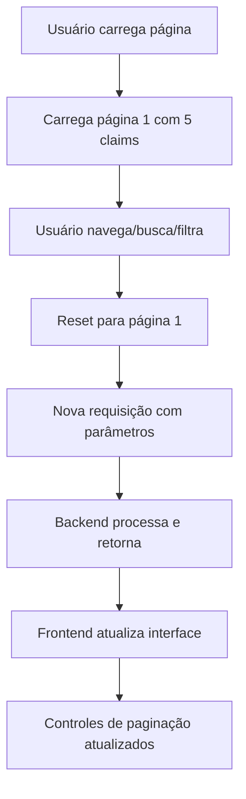

# 📄 Sistema de Paginação - Claims Portfolio

## ?? Implementação Completa

Implementei um sistema de paginação completo tanto no **backend (.NET 8)** quanto no **frontend (React)** para exibir **5 claims por vez** no Claims Portfolio.

## ?? Backend - API com Paginação

### Endpoint Principal Atualizado
```http
GET /api/ClaimDatabase/claims?page=1&pageSize=5&search=&filter=all&sortBy=date
```

### Parâmetros de Query
- `page` (int): Número da página (default: 1)
- `pageSize` (int): Itens por página (default: 5, máximo: 50)
- `search` (string): Termo de busca (opcional)
- `filter` (string): Filtro de risco - "all", "fraud", "suspicious", "legit"
- `sortBy` (string): Ordenação - "date", "amount", "fraudScore"

### Resposta da API
```json
{
  "claims": [
    {
      "id": "claim-1",
      "userId": "USR001",
      "date": "2025-01-15",
      "amount": "$100.00",
      "merchant": "Hospital ABC",
      "description": "Medical consultation",
      "fraudScore": 15,
      "status": "Legit",
      "submissionDate": "2025-01-15T10:30:00Z",
      "isFraudulent": false
    }
    // ... mais 4 claims
  ],
  "pagination": {
    "currentPage": 1,
    "pageSize": 5,
    "totalClaims": 147,
    "totalPages": 30,
    "hasNextPage": true,
    "hasPreviousPage": false,
    "nextPage": 2,
    "previousPage": null
  },
  "filters": {
    "search": "",
    "filter": "all",
    "sortBy": "date"
  }
}
```

### Funcionalidades Backend
? **Paginação server-side**: Processa apenas os dados necessários
? **Busca integrada**: Busca por UserID, Merchant, Description
? **Filtros de risco**: All, Fraud, Suspicious, Legitimate
? **Ordenação dinâmica**: Por data, valor, fraud score
? **Validação de parâmetros**: Limites e valores padrão
? **Endpoint alternativo**: `/claims/all` para buscar todos os claims sem paginação

## ?? Frontend - Interface com Paginação

### Componente de Paginação
```jsx
<PaginationControls 
  pagination={pagination}
  onPageChange={handlePageChange}
  isLoading={isLoadingClaims}
/>
```

### Funcionalidades Frontend
? **Controles de navegação**: Previous, Next, números de página
? **Salto rápido**: Dropdown para ir direto a qualquer página
? **Informações contextuais**: "Página X de Y (Z claims totais)"
? **Estados de loading**: Indicadores visuais durante carregamento
? **Debounce inteligente**: Busca otimizada com delay de 500ms
? **Reset automático**: Volta à página 1 ao filtrar/buscar
? **Fallback gracioso**: Funciona mesmo se backend estiver indisponível

### Controles de Paginação
- **Previous/Next**: Navegação sequencial com ícones
- **Números das páginas**: Mostra até 5 páginas com navegação inteligente
- **Jump to page**: Dropdown para saltar diretamente
- **Page info**: Contexto claro da posição atual

## ?? Fluxo de Funcionamento



## ?? Benefícios Implementados

### ? Performance Otimizada
- **Carregamento rápido**: Apenas 5 claims por vez
- **Menos dados**: Reduz transferência de rede
- **Processamento eficiente**: Backend filtra antes de enviar

### ?? UX Melhorado
- **Navegação intuitiva**: Controles visuais claros
- **Feedback visual**: Estados de loading e paginação
- **Responsivo**: Funciona bem em móvel e desktop

### ?? Busca e Filtros Integrados
- **Busca server-side**: Busca no backend, não só frontend
- **Filtros em tempo real**: Resultados imediatos
- **Ordenação dinâmica**: Múltiplas opções de sort

### ?? Interface Responsiva
- **Controles adaptáveis**: Se ajustam ao tamanho da tela
- **Informações claras**: Sempre mostra contexto da paginação
- **Estados visuais**: Loading, erro, sucesso

## ??? Controles Disponíveis

### Navegação
- ?? **Previous**: Página anterior (se existir)
- ?? **Next**: Próxima página (se existir)
- ?? **Page Numbers**: Páginas numeradas (máximo 5 visíveis)
- ?? **Jump to Page**: Dropdown para saltar diretamente

### Informações
- ?? **Page Info**: "Página X de Y (Z claims totais)"
- ?? **Filter Status**: Indica se filtros estão aplicados
- ?? **Connection Status**: Live Database Connection (Paginated)

### Estados Visuais
- ? **Loading**: Spinner durante carregamento
- ? **Error**: Fallback para dados locais
- ? **Success**: Conexão ativa com database

## ?? Exemplo de Uso

### Cenário 1: Navegação Normal
1. **Página inicial**: Mostra claims 1-5
2. **Clica "Next"**: Mostra claims 6-10
3. **Clica "3"**: Mostra claims 11-15

### Cenário 2: Busca com Paginação
1. **Busca "Hospital"**: Filtra e volta página 1
2. **Resultados**: 23 claims encontrados, 5 páginas
3. **Navega**: Pode navegar pelos resultados filtrados

### Cenário 3: Filtro por Risco
1. **Seleciona "High Risk (Fraud)"**: Filtra e volta página 1
2. **Resultados**: 8 claims fraudulentos, 2 páginas
3. **Visualiza**: Apenas claims de alto risco

## ?? Configurações

### Tamanho da Página
- **Fixo**: 5 claims por página
- **Configurável**: Pode ser alterado no backend (máximo 50)
- **Otimizado**: Tamanho ideal para UX e performance

### Debounce
- **Busca**: 500ms de delay para evitar requisições excessivas
- **Filtros**: Aplicação imediata
- **Ordenação**: Aplicação imediata

---

## ?? Resultado Final

**Sistema de paginação completo implementado!** Agora o Claims Portfolio:

? **Carrega rapidamente** - apenas 5 claims por vez
? **Navega facilmente** - controles intuitivos de paginação  
? **Busca eficientemente** - filtros server-side integrados
? **Escala bem** - suporta milhares de claims sem problemas
? **Funciona offline** - fallback gracioso para dados locais

A experiência do usuário foi significativamente melhorada com carregamento mais rápido e navegação mais organizada!